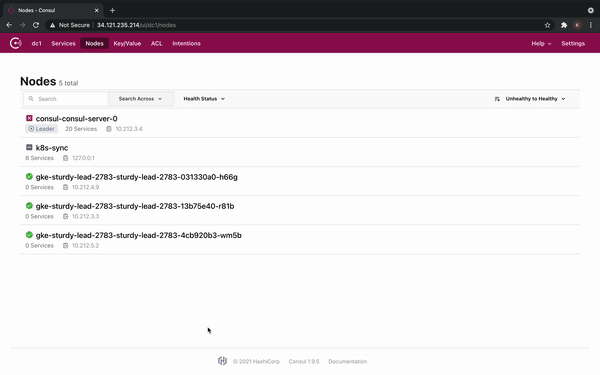

## Distributed Golang Wordcount Server
### Introduction
This project illustrates multithreaded distributive approach for wordcount across multiple Golang servers. See [Demo.](#Demo)
### Desciption
For this project we use Go servers , Consul , Python script. There are 3 threads in this project:
1. First thread in the Go servers is trying to acquire the lock. The "lock" refers to key-value pair in Consul which only one server can hold. You can read more about it [here.](https://www.consul.io/commands/lock)
2. Second thread keeps a check on the healthy webservers in the system at any given point of time.
3. Third Thread is the webserver which waits for the client/leader to send the sentences. 

Consul provides a key-value store with ```lock``` capabilities. Each webserver tries to acquire lock for a specific period of time and releases the lock. Till the time that webserver has the lock it is considered the leader. The functions of the leader are accept incoming request from the client , divide the words by the number of servers that are online and send each server with the words. 
Each server then counts the number of words back to the leader and then the leader once all the words are received counts the words, finds the maximum and minimum number of words and sends it back to the client. 
<br>
<br>
*Its always easier to understand it with an example:* <br>
Suppose there are 4 servers: ```server01```,```server02```,```server03```,```server04```. These servers are trying to acquire the lock. <br>
For this example consider the leader to be ```server02``` <br>
When the client sends a ```POST``` request to any of one of the server. Suppose ```server01```, So ```server01``` will try to find the current leader looking at the value of  the ```lock key```  in Consul. As we know the current leader is ```server02```, ```server01``` will send the request to ```server02``` <br>
Now, ```server02``` will break the words in four parts (since there are 4 servers) and send each server with the request for the wordcount. <br>
Once all the servers have given back the wordcount, it will compile all the responses and send back the ```max``` and ```min``` to ```server01``` which will respond back to the ```client``` <br>
### Demo
*Its even more easier to understand when you see the implementation*<br>
 
<br>
Complete Video: [Here](https://youtu.be/pxkfp4v-DWQ)
<br>


### Requirements
1. Go ```v1.16```
2. ```Python 3```
3. Consul
### Steps to run:
1. Server Setup:
    1. Inside each folder i.e Leadership,Leadership2,Leadership3,Leadership4
    2. Run ``` go run main.go ```<br>
Note: By default Leadership,Leadership2,Leadership3,Leadership4 will run on port 8000,8001,8002,8003 respectively.
2. Client Setup:
    1. Run ```chmod +x main.py```
    2. Run ```./main.py -p <port> -host <hostname> -f <file .txt> ``` or ```./main.py -h``` to see the help menu <br>
    For example: ```./main.py -p 8004 -host localhost -f harrypotter.txt ```


### Creating more servers
Essentially ```main.go``` in leadership[n] folders is the same. <br>
You can configure the ```port``` , ```consul_host``` , ```consul_port``` , ```consul_api_port```, ```server_name```
#### Configuration

Argument | Value
------------ | -------------
```port``` | :```<port>``` (*Unique*)
```consul_host ``` | http://```<consul-host-ip> ```
``` consul_port ``` | :```<port>``` (*Defaults to ```:8080```*)
``` consul_api_port ```| : ```<port>``` (*Defaults to ```:80```*)
``` server_name ```| Server_name (*Unique* with **no** spaces)

#### Steps:
Run these in each folder:
1. ``` go build main.go ```
2. ``` ./main -p <port> -consul_host <consul_host> -consul_port <consul_port> -consul_api_port <consul_api_port> -server_name <server_name> ```


    


